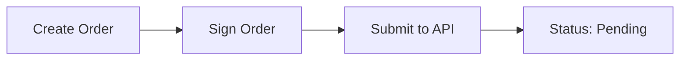
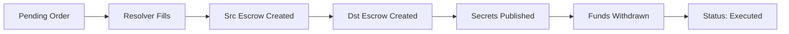
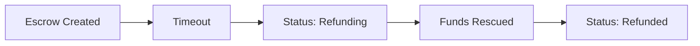
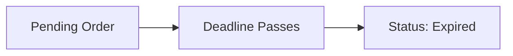
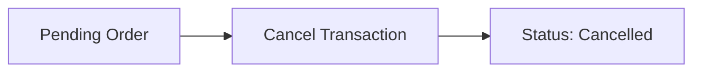

## Overview

The 1inch Cross-Chain SDK provides comprehensive order status tracking through the Orders API. This page documents the order lifecycle, status enums, and how to monitor order progress through fills, escrow events, and completion.

## Order Status Enum

The `OrderStatus` enum represents the high-level state of an order.

```typescript
enum OrderStatus {
  Pending = 'pending',
  Executed = 'executed',
  Expired = 'expired',
  Cancelled = 'cancelled',
  Refunding = 'refunding',
  Refunded = 'refunded'
}
```

<ResponseField name="Pending" type="'pending'">
  Order is active and waiting to be filled
</ResponseField>

<ResponseField name="Executed" type="'executed'">
  Order has been successfully filled and completed
</ResponseField>

<ResponseField name="Expired" type="'expired'">
  Order deadline has passed without being filled
</ResponseField>

<ResponseField name="Cancelled" type="'cancelled'">
  Order was cancelled by the maker or resolver
</ResponseField>

<ResponseField name="Refunding" type="'refunding'">
  Refund process is in progress (atomic swap failed)
</ResponseField>

<ResponseField name="Refunded" type="'refunded'">
  Funds have been refunded to the maker
</ResponseField>

## Fill Status Enum

The `FillStatus` enum tracks the state of individual fills (for orders that allow multiple fills).

```typescript
enum FillStatus {
  Pending = 'pending',
  Executed = 'executed',
  Refunding = 'refunding',
  Refunded = 'refunded'
}
```

<ResponseField name="Pending" type="'pending'">
  Fill transaction submitted but not yet completed
</ResponseField>

<ResponseField name="Executed" type="'executed'">
  Fill successfully completed on both chains
</ResponseField>

<ResponseField name="Refunding" type="'refunding'">
  Fill is being refunded
</ResponseField>

<ResponseField name="Refunded" type="'refunded'">
  Fill funds returned to maker
</ResponseField>

## Validation Status Enum

The `ValidationStatus` enum indicates whether an order is currently valid and fillable.

```typescript
enum ValidationStatus {
  Valid = 'valid',
  OrderPredicateReturnedFalse = 'order-predicate-returned-false',
  NotEnoughBalance = 'not-enough-balance',
  NotEnoughAllowance = 'not-enough-allowance',
  InvalidPermitSignature = 'invalid-permit-signature',
  InvalidPermitSpender = 'invalid-permit-spender',
  InvalidPermitSigner = 'invalid-permit-signer',
  InvalidSignature = 'invalid-signature',
  FailedToParsePermitDetails = 'failed-to-parse-permit-details',
  UnknownPermitVersion = 'unknown-permit-version',
  WrongEpochManagerAndBitInvalidator = 'wrong-epoch-manager-and-bit-invalidator',
  FailedToDecodeRemainingMakerAmount = 'failed-to-decode-remaining',
  UnknownFailure = 'unknown-failure'
}
```

<ResponseField name="Valid" type="'valid'">
  Order is valid and can be filled
</ResponseField>

<ResponseField name="NotEnoughBalance" type="'not-enough-balance'">
  Maker has insufficient token balance
</ResponseField>

<ResponseField name="NotEnoughAllowance" type="'not-enough-allowance'">
  Maker has not approved sufficient token allowance
</ResponseField>

<ResponseField name="InvalidSignature" type="'invalid-signature'">
  Order signature is invalid
</ResponseField>

<Note>
  See the complete enum definition for all validation statuses
</Note>

## Escrow Events

### EscrowEventSide

Indicates which chain an escrow event occurred on.

```typescript
enum EscrowEventSide {
  Src = 'src',
  Dst = 'dst'
}
```

### EscrowEventAction

Describes the type of escrow event.

```typescript
enum EscrowEventAction {
  SrcEscrowCreated = 'src_escrow_created',
  DstEscrowCreated = 'dst_escrow_created',
  Withdrawn = 'withdrawn',
  FundsRescued = 'funds_rescued',
  EscrowCancelled = 'escrow_cancelled'
}
```

<ResponseField name="SrcEscrowCreated" type="'src_escrow_created'">
  Escrow created on source chain (order filled)
</ResponseField>

<ResponseField name="DstEscrowCreated" type="'dst_escrow_created'">
  Escrow created on destination chain (resolver deposited)
</ResponseField>

<ResponseField name="Withdrawn" type="'withdrawn'">
  Funds withdrawn from escrow (swap completed)
</ResponseField>

<ResponseField name="FundsRescued" type="'funds_rescued'">
  Funds rescued after timeout
</ResponseField>

<ResponseField name="EscrowCancelled" type="'escrow_cancelled'">
  Escrow cancelled
</ResponseField>

### EscrowEventData

Complete escrow event data structure.

```typescript
type EscrowEventData = {
  transactionHash: string
  escrow: string
  side: EscrowEventSide
  action: EscrowEventAction
  blockTimestamp: number  // Unix timestamp in ms
}
```

<ParamField path="transactionHash" type="string" required>
  Transaction hash where event occurred
</ParamField>

<ParamField path="escrow" type="string" required>
  Escrow contract/account address
</ParamField>

<ParamField path="side" type="EscrowEventSide" required>
  Source or destination chain
</ParamField>

<ParamField path="action" type="EscrowEventAction" required>
  Type of escrow action
</ParamField>

<ParamField path="blockTimestamp" type="number" required>
  Event timestamp in milliseconds
</ParamField>

## Fill Data

Detailed information about an order fill.

```typescript
type Fill = {
  status: FillStatus
  txHash: string
  filledMakerAmount: string
  filledAuctionTakerAmount: string
  escrowEvents: EscrowEventData[]
}
```

<ParamField path="status" type="FillStatus" required>
  Current status of the fill
</ParamField>

<ParamField path="txHash" type="string" required>
  Source chain fill transaction hash
</ParamField>

<ParamField path="filledMakerAmount" type="string" required>
  Amount filled on source chain (bigint string)
</ParamField>

<ParamField path="filledAuctionTakerAmount" type="string" required>
  Amount filled on destination chain (bigint string)
</ParamField>

<ParamField path="escrowEvents" type="EscrowEventData[]" required>
  Array of escrow events for this fill
</ParamField>

## Order Status Response

Complete order status information returned by the API.

```typescript
type OrderStatusResponse = {
  orderHash: string
  status: OrderStatus
  validation: ValidationStatus
  points: AuctionPoint[]
  approximateTakingAmount: string
  positiveSurplus: string
  fills: Fill[]
  auctionStartDate: number      // unix timestamp in sec
  auctionDuration: number        // in sec
  initialRateBump: number
  createdAt: number              // unix timestamp in ms
  srcTokenPriceUsd: string | null
  dstTokenPriceUsd: string | null
  cancelTx: string | null
  dstChainId: SupportedChain
  cancelable: boolean
  takerAsset: string
  timeLocks: string              // hex encoded with 0x prefix
} & (
  | { srcChainId: EvmChain; order: LimitOrderV4Struct; extension: string }
  | { srcChainId: SolanaChain; order: SolanaOrderJSON }
)
```

<ResponseField name="orderHash" type="string">
  Unique order identifier
</ResponseField>

<ResponseField name="status" type="OrderStatus">
  Current order status
</ResponseField>

<ResponseField name="validation" type="ValidationStatus">
  Order validation status
</ResponseField>

<ResponseField name="points" type="AuctionPoint[]">
  Auction price curve points
</ResponseField>

<ResponseField name="approximateTakingAmount" type="string">
  Estimated taking amount based on current auction price
</ResponseField>

<ResponseField name="positiveSurplus" type="string">
  Positive surplus amount if execution was better than minimum
</ResponseField>

<ResponseField name="fills" type="Fill[]">
  Array of fills (empty if not filled, can have multiple for partial fills)
</ResponseField>

<ResponseField name="auctionStartDate" type="number">
  Auction start timestamp (seconds)
</ResponseField>

<ResponseField name="auctionDuration" type="number">
  Auction duration (seconds)
</ResponseField>

<ResponseField name="initialRateBump" type="number">
  Initial rate bump percentage (basis points, e.g., 100000 = 10%)
</ResponseField>

<ResponseField name="createdAt" type="number">
  Order creation timestamp (milliseconds)
</ResponseField>

<ResponseField name="srcTokenPriceUsd" type="string | null">
  Source token price in USD
</ResponseField>

<ResponseField name="dstTokenPriceUsd" type="string | null">
  Destination token price in USD
</ResponseField>

<ResponseField name="cancelTx" type="string | null">
  Cancellation transaction hash if cancelled
</ResponseField>

<ResponseField name="dstChainId" type="SupportedChain">
  Destination chain ID
</ResponseField>

<ResponseField name="cancelable" type="boolean">
  Whether order can currently be cancelled
</ResponseField>

<ResponseField name="takerAsset" type="string">
  Destination token address
</ResponseField>

<ResponseField name="timeLocks" type="string">
  Time locks encoded as hex string
</ResponseField>

## Order Lifecycle

A cross-chain order flows through several states:

### 1. Order Creation



When an order is created and submitted, it enters the `Pending` state with `ValidationStatus.Valid`.

### 2. Order Filling



1. Resolver fills order on source chain (creates source escrow)
2. Resolver deposits on destination chain (creates destination escrow)
3. Secrets are published
4. Both parties withdraw funds
5. Order status becomes `Executed`

### 3. Failed Swap / Refund



If the atomic swap fails (e.g., secret not published in time):

1. Time lock expires
2. Status changes to `Refunding`
3. Maker rescues funds from escrow
4. Status changes to `Refunded`

### 4. Order Expiration



If the order is not filled before the deadline, it becomes `Expired`.

### 5. Order Cancellation



Makers or resolvers (if configured) can cancel orders before they're filled.

## Using the Orders API

### Get Order Status

Query the current status of an order by its hash.

```typescript
import { CrossChainSDK } from '@1inch/cross-chain-sdk'

const sdk = new CrossChainSDK({ apiKey: 'your-api-key' })

const status = await sdk.orders.getOrderStatus({
  orderHash: '0x...' // or base58 for Solana
})

console.log('Order status:', status.status)
console.log('Validation:', status.validation)
console.log('Fills:', status.fills.length)

// Check escrow events
for (const fill of status.fills) {
  console.log('Fill:', fill.txHash)
  for (const event of fill.escrowEvents) {
    console.log(`  ${event.side} ${event.action} at ${event.transactionHash}`)
  }
}
```

### Get Active Orders

Fetch all active orders with optional filtering.

```typescript
const activeOrders = await sdk.orders.getActiveOrders({
  srcChainId: 1,      // Ethereum
  dstChainId: 137,    // Polygon
  page: 1,
  limit: 50
})

for (const order of activeOrders.items) {
  console.log('Order:', order.orderHash)
  console.log('Remaining:', order.remainingMakerAmount)
  console.log('Fills:', order.fills.length)
}
```

### Get Orders by Maker

Retrieve all orders for a specific maker address.

```typescript
const makerOrders = await sdk.orders.getOrdersByMaker({
  address: '0x...', // or Solana address
  srcChain: 1,
  dstChain: 137,
  page: 1,
  limit: 20
})

for (const order of makerOrders.items) {
  console.log('Order:', order.orderHash)
  console.log('Status:', order.status)
  console.log('Maker amount:', order.makerAmount)
  console.log('Taking amount:', order.approximateTakingAmount)
}
```

### Monitor Order Progress

Poll order status to track progress.

```typescript
async function monitorOrder(orderHash: string) {
  const poll = async () => {
    const status = await sdk.orders.getOrderStatus({ orderHash })
    
    console.log('Status:', status.status)
    console.log('Validation:', status.validation)
    
    if (status.status === 'executed') {
      console.log('Order completed!')
      return true
    }
    
    if (status.status === 'expired' || status.status === 'cancelled') {
      console.log('Order did not complete:', status.status)
      return true
    }
    
    if (status.status === 'refunded') {
      console.log('Order refunded')
      return true
    }
    
    // Still pending or refunding
    return false
  }
  
  // Poll every 5 seconds
  while (!(await poll())) {
    await new Promise(resolve => setTimeout(resolve, 5000))
  }
}

await monitorOrder('0x...')
```

## Order Type Enum

The `OrderType` enum distinguishes between single-fill and multiple-fill orders.

```typescript
enum OrderType {
  SingleFill = 'SingleFill',
  MultipleFills = 'MultipleFills'
}
```

<ResponseField name="SingleFill" type="'SingleFill'">
  Order can only be filled once with the full amount
</ResponseField>

<ResponseField name="MultipleFills" type="'MultipleFills'">
  Order can be filled multiple times (partial fills enabled)
</ResponseField>

## API Version

The Orders API supports versioning through the `ApiVersion` enum.

```typescript
enum ApiVersion {
  V1_1 = '1.1',
  V1_2 = '1.2'
}
```

Filter orders by version when querying:

```typescript
const orders = await sdk.orders.getActiveOrders({
  orderVersion: [ApiVersion.V1_2]
})
```

## Related Types

- [EvmCrossChainOrder](/api/evm-order) - EVM order structure and methods
- [SvmCrossChainOrder](/api/solana-order) - Solana order structure and methods
- [HashLock](/api/hash-lock) - Hash lock implementation for atomic swaps
